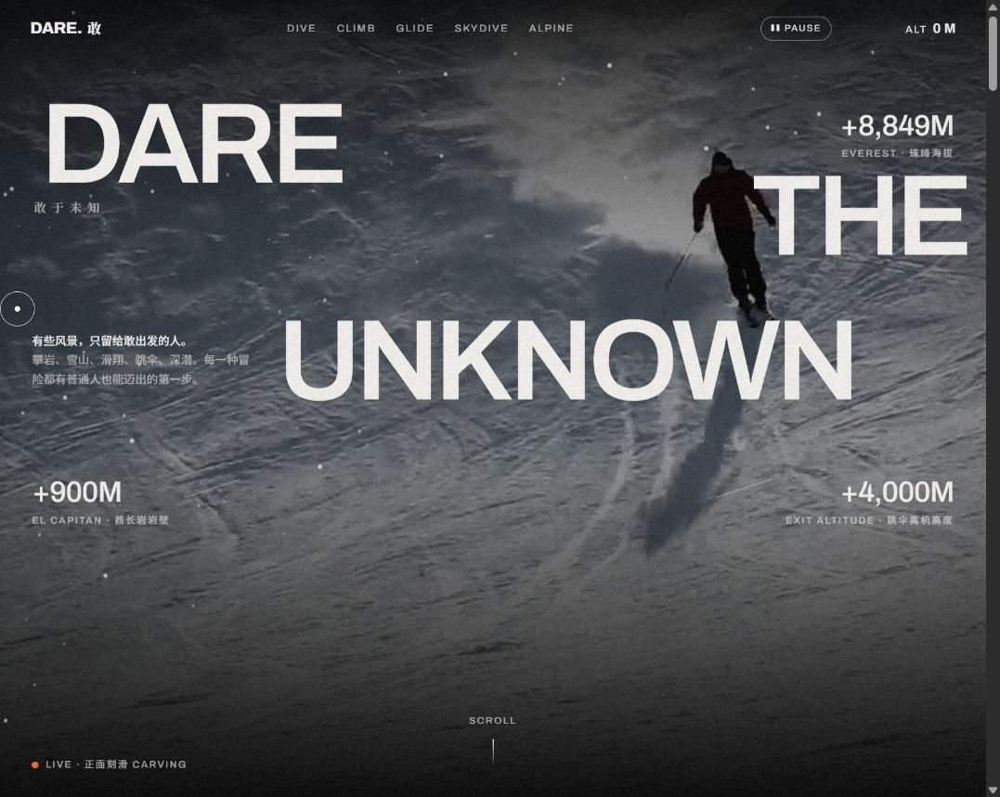
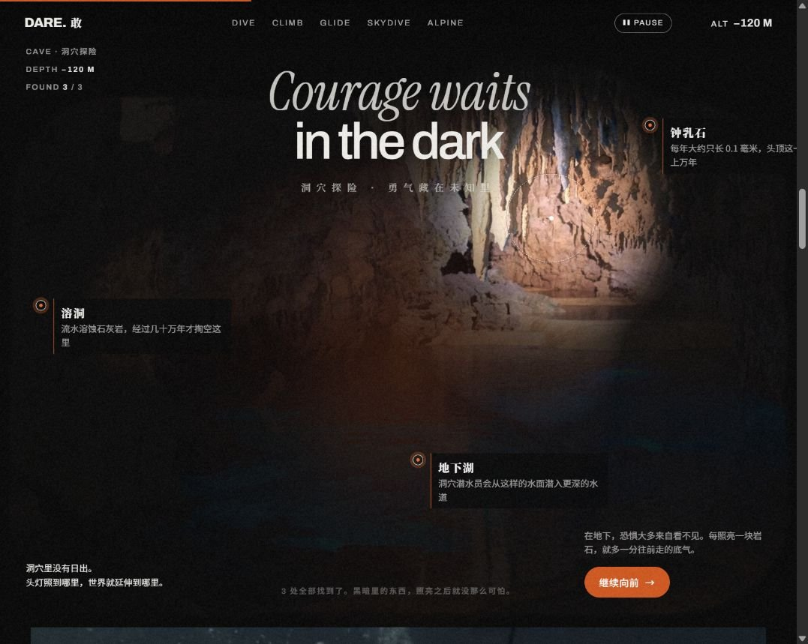
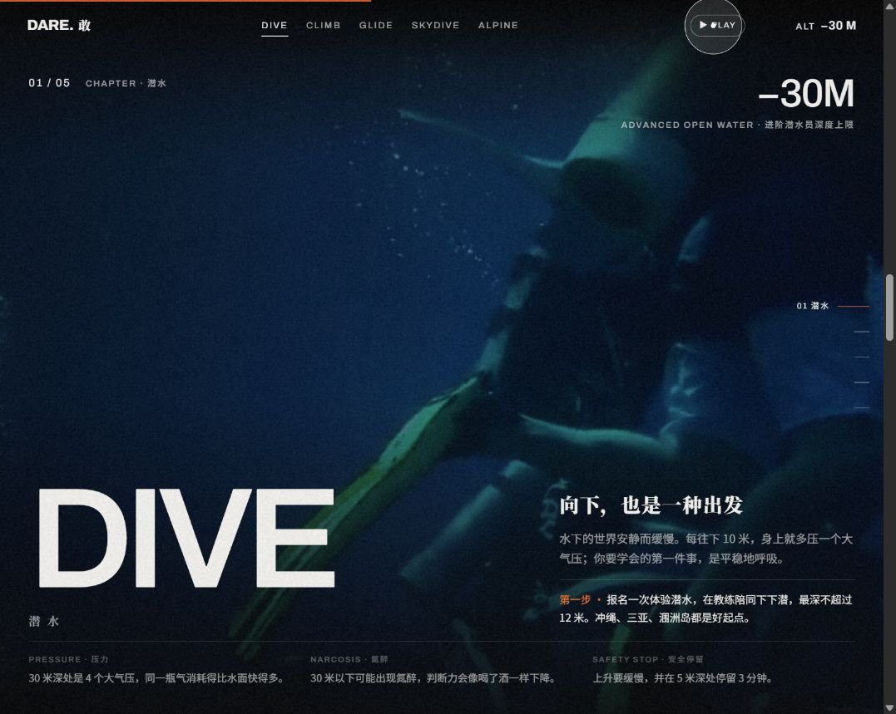
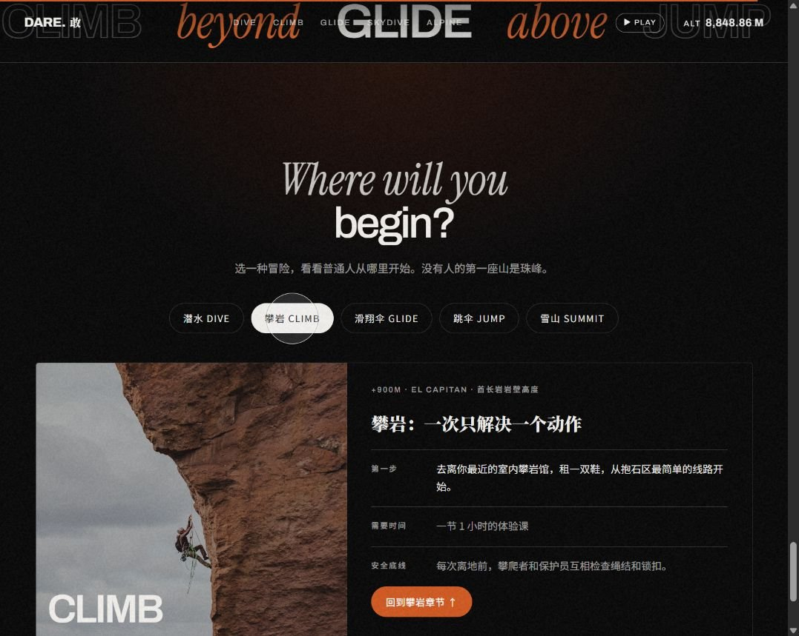

# DARE 敢于未知

### 从深海到雪山，跟随滚动开启一段冒险旅程

**DARE 敢于未知** 是一个以户外冒险为主题的沉浸式交互网页。它将滑雪视频、洞穴头灯探索、五大冒险章节和入门选择卡片串联成一段连续的浏览体验：先感受出发的冲动，再照亮未知，随后从水下走向岩壁、天空与雪山，最后选择自己想迈出的第一步。

作品使用 **HTML、CSS、原生 JavaScript 和 Lenis** 构建，采用深色画面、大幅英文排版、中文叙事和橙色强调色。视频背景、分层滚动、鼠标互动与动态文字共同营造电影感，让访客在浏览内容的同时参与探索。

> 有些风景，只留给敢出发的人。每一种冒险，都有普通人也能迈出的第一步。

**[查看项目源码](https://github.com/johnhuasheng/dare-adventure) · [下载完整项目](https://github.com/johnhuasheng/dare-adventure/archive/refs/heads/main.zip)**

**在线预览状态：** 目前尚未提供可访问的 GitHub Pages 预览链接。可以先下载项目，在电脑上打开；后续启用在线预览后，再补充实际网址。

## 作品预览

以下图片为网页实际运行截图。视频、滚动动画和头灯效果需要打开网页才能体验。

**滑雪首屏：大字排版、动态背景与海拔信息**



**洞穴探索：用头灯照亮黑暗，寻找隐藏发现点**



**冒险章节：视频画面、主题文字与知识卡片**



**你的第一步：选择冒险，查看对应的入门信息**



## 网页里有什么

### 1. 开场：DARE THE UNKNOWN

页面从加载动画进入滑雪视频首屏。英文大标题与“敢于未知”的中文主题相互呼应，周围呈现珠峰、酋长岩和跳伞高度等主题数据。

继续向下滚动，背景逐渐放大，不同层次的文字依次移动、淡出，攀岩、滑翔和雪山的介绍卡片随之展开。首屏末尾汇集五种冒险入口，让浏览自然过渡到后面的探索与章节内容。

### 2. 洞穴：勇气藏在未知里

洞穴区域以黑暗和局部光照构成探索体验。移动鼠标时，光圈会跟随移动，如同戴着头灯寻找前方的岩石与水面；按住鼠标左键，可以扩大照明范围。

画面里藏着 **钟乳石、地下湖、溶洞** 三个发现点。光圈靠近它们时，页面会显示相应的名称与介绍，并更新 `FOUND / 3` 的发现数量。找到全部三处后，提示文字也会变化。鼠标暂时停止操作时，光斑会自动游走。

探索完成后，可以点击“继续向前”，进入潜水章节。

### 3. 五个冒险章节：从水下到山顶

五个章节以从低处到高处的空间意象组织内容。每章都包含视频背景、中英文主题、代表性高度或深度、叙事文字、“第一步”建议，以及三组知识信息。

| 章节 | 页面标识 | 叙事主题 | 主要内容 |
| --- | --- | --- | --- |
| 潜水 | DIVE | 向下，也是一种出发 | 水下探索、呼吸与压力，介绍体验潜水的入门方向，并展示压力、氮醉和安全停留等知识点。 |
| 攀岩 | CLIMB | 一次只解决一个动作 | 通过手点、脚点和重心讲述攀爬过程，介绍室内岩馆体验，并展示难度、脚法与抱石相关内容。 |
| 滑翔伞 | GLIDE | 借一股看不见的风 | 介绍借助热气流飞行的体验，以及双人带飞与地面操伞的入门方向；知识卡片围绕热气流、伞翼和带飞展开。 |
| 跳伞 | JUMP | 跨出舱门的那一步 | 呈现自由落体与开伞后的感受，介绍双人跳伞体验，并展示自由落体、备份伞与呼吸相关内容。 |
| 雪山 | SUMMIT | 把目标拆成营地 | 围绕体能准备、营地适应和折返意识展开，介绍高海拔徒步与向导团队，并展示高海拔、入门山峰和折返相关内容。 |

### 4. 你的第一步：把兴趣变成一个起点

在 `Where will you begin?` 区域，可以点击潜水、攀岩、滑翔伞、跳伞、雪山五个按钮，切换对应的入门卡片。

卡片会同步更新配图、章节标识、主题标题和三类信息：

- **第一步：** 可以从什么体验或准备开始。
- **需要时间：** 页面给出的体验或准备时间参考。
- **安全底线：** 该主题对应的安全提示。

默认选中攀岩。卡片底部提供“回到对应章节”的按钮，方便重新浏览感兴趣的内容。

### 5. 结尾：回望旅程

页面以横向循环字幕、轮换的中英文冒险名言和安全提示收尾，并提供“回到顶部”入口，方便再次体验开场。

## 怎么玩：第一次打开建议这样体验

1. **先停留在首屏。** 等待加载动画结束，观看滑雪背景，移动鼠标观察大标题的轻微位移和雪花的变化。
2. **缓慢向下滚动。** 感受背景放大、文字分层移动和内容渐次展开的过程。
3. **进入洞穴后移动鼠标。** 在画面中寻找三个发现点，按住鼠标左键扩大光圈，观察发现数量与提示变化。
4. **继续浏览五个冒险章节。** 也可以使用顶部导航或桌面布局下的右侧章节导航，直接跳转到喜欢的主题。
5. **到页面下方选择“你的第一步”。** 点击不同的冒险按钮，对比卡片里的入门方式、时间参考和安全提示。
6. **需要静态阅读时暂停视频。** 点击右上角的 `PAUSE`；再次点击 `PLAY` 恢复播放。这个按钮控制视频播放，滚动和其他交互仍然可以使用。

### 常用操作

| 想做什么 | 操作方式 | 页面反馈 |
| --- | --- | --- |
| 顺序浏览整段旅程 | 滚动鼠标滚轮或触控板 | 页面平滑移动，背景和文字随滚动变化。 |
| 直接进入某一章 | 点击顶部 `DIVE / CLIMB / GLIDE / SKYDIVE / ALPINE` | 跳转到潜水、攀岩、滑翔伞、跳伞或雪山章节。 |
| 在章节之间切换 | 点击右侧章节导航 | 跳转到目标章节，并显示当前章节标记。 |
| 探索洞穴 | 移动鼠标，按住左键扩大光圈 | 局部画面被照亮，发现点出现说明，发现数量增加。 |
| 暂停或恢复视频 | 点击右上角 `PAUSE / PLAY` | 首屏及章节视频暂停或恢复。 |
| 查看某种冒险的入门信息 | 点击页面下方五个冒险按钮 | 配图、标题、第一步、时间和安全提示同步切换。 |
| 返回开场 | 点击左上角 `DARE.敢` 或页脚“回到顶部” | 页面滚动回到首屏。 |

顶部进度条展示整页浏览进度；`ALT` 读数随当前区域变化，用于呼应页面的高度与深度主题，是章节展示数值。

## 设计与交互特点

### 电影感的视觉语言

- **大幅视频背景：** 滑雪开场与五个冒险章节使用视频营造场景氛围，并配有照片背景。
- **深色与橙色：** 低亮度背景承托白色大字，橙色强调按钮、进度和重点内容。
- **中英文组合排版：** 英文大标题、衬线斜体和中文叙事交错出现，形成不同的阅读节奏。
- **胶片颗粒与雪花：** 颗粒纹理增加画面质感，首屏 Canvas 雪花随鼠标位置改变横向运动。

### 连续的滚动叙事

- **首屏分层移动：** 背景缩放与不同文字层的位移共同形成空间感。
- **章节入场动画：** 章节背景展开，标题字母和信息内容依次出现。
- **章节背景视差：** 视频与照片层随滚动轻微移动。
- **平滑锚点跳转：** 导航入口与“回到章节”按钮衔接整页体验。

### 让访客参与的细节

- **鼠标跟随标题与自定义光标：** 桌面鼠标操作下呈现不同层次的跟随效果，悬停链接或按钮时光圈发生变化。
- **洞穴头灯：** 光照、扩大光圈、发现点说明和数量反馈构成一个可探索的区域。
- **入门卡片切换：** 将五种冒险的信息放在统一结构里，便于浏览与对比。
- **即时浏览反馈：** 章节高亮、顶部进度条、海拔读数和数字计数共同标记当前浏览位置。

### 对不同设备与阅读偏好的适配

网页设有响应式布局：窄屏下会调整文字、章节和卡片布局，并隐藏部分桌面导航与提示。电脑配合鼠标更适合体验头灯探索、自定义光标和标题跟随效果。

当系统开启“减少动态效果”时，页面会减少部分动画，默认暂停视频，并关闭部分鼠标与粒子效果。`PAUSE` 按钮则可以在普通浏览模式下随时暂停视频。

## 下载与本地运行

### 方法一：下载 ZIP，直接打开

1. 点击本页上方的[下载完整项目](https://github.com/johnhuasheng/dare-adventure/archive/refs/heads/main.zip)，或在仓库页面选择 **Code → Download ZIP**。
2. 将压缩包完整解压，保留 `index.html`、`style.css`、`js` 和 `assets` 之间的文件结构。
3. Windows 用户双击 **`启动网页.bat`**；也可以直接用浏览器打开 **`index.html`**。
4. 允许页面加载视频与照片，再开始滚动体验。

项目是静态网页，直接打开不需要安装 npm 依赖或执行构建命令。建议使用近期版本的 Edge 或 Chrome；在其他系统中也可以直接打开 `index.html`。

### 方法二：克隆项目

已经安装 Git 的用户可以在终端中执行：

```powershell
git clone https://github.com/johnhuasheng/dare-adventure.git
cd dare-adventure
```

Windows 用户随后执行：

```powershell
.\启动网页.bat
```

### 视频与照片怎么加载

网页优先读取 `assets` 中的本地媒体。对应文件不存在或加载失败时，会尝试读取代码中配置的网络地址。仓库提供的是网页代码与下载脚本，没有打包原始视频和照片。

因此，刚下载项目时需要联网才能加载这些素材。文字、导航和卡片由本地网页代码生成，媒体加载情况则取决于对应文件和网络资源是否可用。

### 想减少联网需求

Windows 用户可以在联网时双击 **`下载素材.bat`**。脚本调用 `curl`，将六段视频和七张照片保存到：

```text
assets/videos/    视频
assets/images/    照片
```

下载成功后，重新打开网页即可优先使用本地媒体。脚本会跳过已经存在的文件，并显示下载失败的提示；下载所需时间和实际体积取决于网络与源文件。

**离线使用说明：** 本地媒体下载完整后，视频和照片可以从本地读取；页面字体仍通过 Google Fonts 引入，完全断网时可能使用回退字体，因此离线画面与联网时的排版可能略有差异。

## 遇到这些情况怎么办

| 情况 | 可以先检查什么 |
| --- | --- |
| 文字正常，但视频或照片没有出现 | 检查是否联网、素材来源是否能访问，或者运行下载脚本补齐本地媒体。 |
| 视频没有自动播放 | 点击右上角 `PLAY`，并检查浏览器是否限制自动播放；系统“减少动态效果”模式也会默认暂停视频。 |
| 本地打开后样式或按钮不正常 | 确认已完整解压，`style.css` 和 `js` 文件夹仍与 `index.html` 保持原有相对位置。 |
| 下载脚本提示找不到 `curl` | 该脚本依赖 Windows 系统可用的 `curl`；可以先联网打开网页，使用配置好的远程素材。 |
| 手机上没有右侧章节导航或自定义光标 | 这些效果根据屏幕宽度与输入方式显示；完整的鼠标探索体验适合在电脑上查看。 |

## 技术与文件结构

| 技术 | 在项目中的用途 |
| --- | --- |
| HTML | 页面结构、导航入口和内容区域。 |
| CSS | 视觉样式、响应式布局、过渡和字幕动画。 |
| 原生 JavaScript | 数据渲染、章节导航、视频控制、数字变化和卡片切换。 |
| Lenis | 平滑滚动与锚点跳转。 |
| Canvas 2D | 雪花粒子、颗粒纹理和洞穴头灯绘制。 |
| IntersectionObserver | 根据区域进入或离开视口，控制章节效果和视频加载、播放。 |
| requestAnimationFrame | 连续更新滚动视觉效果、光标跟随、粒子和光照。 |

```text
dare-adventure/
├── index.html           页面结构与静态文字
├── style.css            视觉样式、动画与响应式布局
├── js/
│   ├── data.js          章节数据、入门信息、素材地址、发现点与名言
│   ├── main.js          渲染、滚动、视频和互动逻辑
│   └── lenis.min.js     平滑滚动库
├── assets/
│   ├── 说明.txt         本地媒体目录说明
│   ├── images/          下载脚本生成的照片目录
│   └── videos/          下载脚本生成的视频目录
├── docs/images/         README 使用的实际运行截图
├── 启动网页.bat         Windows 浏览器打开入口
├── 下载素材.bat         Windows 媒体下载脚本
├── .gitignore           排除下载到本地的原始视频与照片
├── .nojekyll            静态页面发布辅助文件
└── README.md            项目介绍与使用说明
```

`assets/images/` 和 `assets/videos/` 由下载脚本创建，不属于仓库中随代码提供的媒体文件。

### 想修改这个作品

- **改章节、入门卡片、名言或素材地址：** 编辑 `js/data.js`。
- **改首屏、洞穴区域和页脚的静态文字：** 编辑 `index.html`。
- **改颜色、字体、间距或手机布局：** 编辑 `style.css`。
- **改滚动效果、头灯逻辑和视频行为：** 编辑 `js/main.js`。

更换素材地址后，如果仍保留同名本地媒体，网页会优先显示本地文件；若希望下载脚本获取新素材，需要同步修改脚本里的地址。

## 素材与第三方组件

- 视频地址使用 [Pexels](https://www.pexels.com/) 提供的资源。
- 照片地址使用 [Unsplash](https://unsplash.com/) 提供的资源。
- 平滑滚动使用 [Lenis](https://github.com/darkroomengineering/lenis)。
- 字体通过 [Google Fonts](https://fonts.google.com/) 引入：Archivo、Instrument Serif、Noto Sans SC、Noto Serif SC。
- `docs/images/` 中的图片是本项目网页的运行截图，用于展示页面效果。

媒体素材与第三方组件的权利归相应作者或维护者所有；使用或替换时，应查看对应资源的授权说明。

## 内容定位与安全提示

这个作品用于展示网页设计、交互叙事与冒险主题内容。页面里的时间、地点、运动知识和“第一步”建议是展示与入门参考，实际活动应以有资质机构、教练或向导提供的指导为准。

潜水、攀岩、滑翔伞、跳伞与高山攀登均存在风险，请结合个人条件、装备和天气，在有资质人员指导下进行。

**敢于出发，也敢于在该回头的时候回头。**
